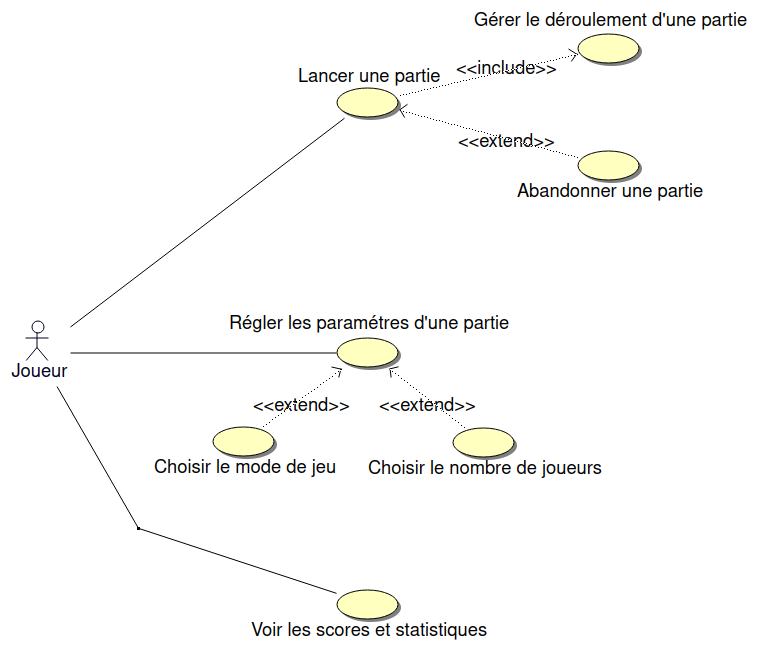

 

 

# Le projet jolly-jumpi 2024

- [Le projet jolly-jumpi 2024](#le-projet-jolly-jumpi-2024)
  - [Présentation](#présentation)
  - [Fonctionnalités](#fonctionnalités)
  - [Screenshots](#screenshots)
  - [Documentation du code](#documentation-du-code)
  - [Diagramme de classes](#diagramme-de-classes)
  - [Protocole](#protocole)
  - [Historique des versions](#historique-des-versions)
  - [Auteurs](#auteurs)

---

## Présentation

Le système Jolly-JumPi est un système numérique permettant de jouer au tiercé de manière ludique : soyez le premier à faire franchir à votre jockey la ligne d’arrivée. Pour cela, envoyez vos balles dans les trous aux couleurs différentes. Cheval au pas, au trot ou au galop ? A vous de viser le plus juste possible.

## Fonctionnalités

## Screenshots

## Documentation du code

https://btssn-lasalle-84.github.io/jolly-jumpi-2024/

## Diagramme de classes

## Protocole

## Historique des versions

- Version 1.0

- Version 0.2

- Version 0.1

## Auteurs

- Étudiant IR : ARMANDO Célian <<celianarmando@gmail.com>>

---
©️ LaSalle Avignon 2024